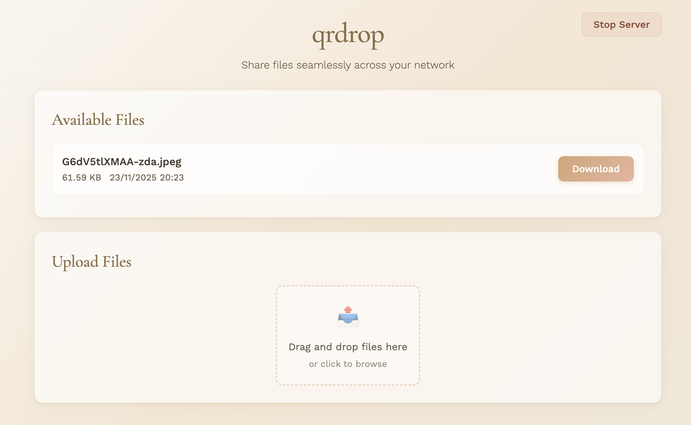

# qrdrop

A two-way LAN file-sharing CLI tool built with Bun. Share files across your local network with a simple QR code scan.

> Inspired by [`qrcp`](https://github.com/claudiodangelis/qrcp) — see [feature comparison](#comparison-with-qrcp)

| CLI                         | Web UI                       |
| --------------------------- | ---------------------------- |
|  |  |

> **Note:** Like all local network file-sharing tools, qrdrop shares files over your LAN. Be mindful of what you share and consider using the built-in security features (IP allowlists, rate limiting, HTTPS) for sensitive files. This is standard practice for any tool in this category.

## Installation

### Quick Install (Recommended)

**One command installation:**

```bash
curl -fsSL https://raw.githubusercontent.com/behnamazimi/qrdrop/main/install.sh | sh
```

Or with wget:

```bash
wget -qO- https://raw.githubusercontent.com/behnamazimi/qrdrop/main/install.sh | sh
```

### Download Binary

Download the pre-built binary for your platform from [GitHub Releases](https://github.com/behnamazimi/qrdrop/releases/latest):

- **Windows:** [qrdrop-windows-x64.exe](https://github.com/behnamazimi/qrdrop/releases/latest/download/qrdrop-windows-x64.exe)
- **macOS (Intel):** [qrdrop-macos-x64](https://github.com/behnamazimi/qrdrop/releases/latest/download/qrdrop-macos-x64)
- **macOS (Apple Silicon):** [qrdrop-macos-arm64](https://github.com/behnamazimi/qrdrop/releases/latest/download/qrdrop-macos-arm64)
- **Linux:** [qrdrop-linux-x64](https://github.com/behnamazimi/qrdrop/releases/latest/download/qrdrop-linux-x64)

After downloading, make it executable (macOS/Linux):

```bash
chmod +x qrdrop
mv qrdrop /usr/local/bin/
```

### From Source

For developers who want to build from source:

```bash
git clone https://github.com/behnamazimi/qrdrop.git
cd qrdrop
bun install
bun run build
```

## Usage

**Share files:**

```bash
qrdrop document.pdf                     # Single file (positional argument)
qrdrop --file document.pdf              # Single file (explicit flag)
qrdrop -f file1.txt -f file2.txt        # Multiple files
qrdrop --directory ./folder             # All files in directory
qrdrop .  --allow-types png,pdf         # Share all png and pdf files in current directory
```

**Receive files:**

```bash
qrdrop --output ./downloads
```

**Two-way sharing:**

```bash
qrdrop --file doc.pdf --output ./received
```

**Commands:**

```bash
qrdrop init                             # Interactive configuration wizard
qrdrop status                           # Show configuration and server status
qrdrop cert generate                    # Generate TLS certificate for your IP
qrdrop completion bash                  # Generate shell completion script
```

## Options

| Option                      | Short  | Description                                            |
| --------------------------- | ------ | ------------------------------------------------------ | ----------------------- |
| `--file <path>`             | `-f`   | Share file(s) (use multiple times, or use `.` for cwd) |
| `--directory [path]`        | `-d`   | Share directory (default: current)                     |
| `--output <path>`           | `-o`   | Directory for received files                           |
| `--secure`                  |        | Enable HTTPS/TLS (auto-generates self-signed cert)     |
| `--cert <path>`             |        | Custom TLS certificate file (implies --secure)         |
| `--key <path>`              |        | Custom TLS private key file (implies --secure)         |
| `--port <number>`           |        | Specify port (default: 1673)                           |
| `--host <ip                 | fqdn>` |                                                        | Specify host IP or FQDN |
| `--interface <name>`        |        | Network interface (use "any" for all)                  |
| `--timeout <seconds>`       |        | Set timeout (default: 600s / 10 minutes)               |
| `--keep-alive`              |        | Run indefinitely (disable timeout)                     |
| `--zip`                     |        | Zip files/directories before sharing                   |
| `--url-path <path>`         |        | Custom URL path (default: random 16-char string)       |
| `--config <path>`           |        | Custom config file path                                |
| `--copy-url`                |        | Automatically copy URL to clipboard                    |
| `--allow-ips <ip1,ip2>`     |        | Restrict access to specific IPs (wildcard/CIDR)        |
| `--rate-limit <number>`     |        | Max requests per window (default: 100)                 |
| `--rate-limit-window <sec>` |        | Rate limit window in seconds (default: 60)             |
| `--allow-types <ext1,ext2>` |        | Restrict to specific file types/extensions             |
| `--verbose`                 | `-v`   | Verbose logging                                        |
| `--debug`                   |        | Debug logging (includes verbose)                       |
| `--log-file <path>`         |        | Write logs to file                                     |
| `--json-log`                |        | JSON log format                                        |
| `--no-color`                |        | Disable colored output                                 |
| `--interactive`             | `-i`   | Interactive file picker                                |
| `--help`                    | `-h`   | Show help message                                      |

## Commands

| Command                | Description                          |
| ---------------------- | ------------------------------------ |
| `qrdrop init`          | Interactive configuration wizard     |
| `qrdrop status`        | Show configuration and server status |
| `qrdrop cert generate` | Generate TLS certificate for your IP |
| `qrdrop completion`    | Generate shell completion scripts    |

## Examples

```bash
# Basic file sharing
qrdrop document.pdf                       # Share a single file
qrdrop file1.txt file2.txt                # Share multiple files (positional)
qrdrop --file . --output ./received       # Share cwd and receive files

# Directory sharing
qrdrop --directory ./project              # Share all files in directory
qrdrop --zip --directory ./project        # Zip directory before sharing

# Network configuration
qrdrop --port 8080 --file doc.pdf         # Use specific port
qrdrop --interface eth0 --file document.pdf        # Use specific network interface
qrdrop --interface any --file document.pdf         # Bind to all interfaces
qrdrop --host fileserver.local --file doc.pdf  # Use FQDN instead of IP

# HTTPS/TLS
qrdrop --secure --file secret.txt         # Auto-generate self-signed certificate
qrdrop --cert ./my.crt --key ./my.key --file doc.pdf  # Use custom certificate
qrdrop cert generate                      # Generate certificate for auto-detected IP
qrdrop cert generate --host 192.168.1.100 # Generate certificate for specific IP
qrdrop cert generate --interface eth0              # Generate certificate for specific interface
qrdrop cert generate --cert ./my.crt --key ./my.key  # Custom output paths

# Timeout and keep-alive
qrdrop --timeout 300 --file doc.pdf       # Custom timeout (5 minutes)
qrdrop --keep-alive --output ./collected  # Run indefinitely

# URL and clipboard
qrdrop --url-path /myfiles --file doc.pdf # Custom URL path (instead of random)
qrdrop --copy-url --file doc.pdf          # Auto-copy URL to clipboard

# Security: IP allowlist
qrdrop --allow-ips 192.168.1.100 --file doc.pdf           # Single IP
qrdrop --allow-ips 192.168.1.0/24 --file doc.pdf          # CIDR range
qrdrop --allow-ips "192.168.*.*" --file doc.pdf           # Wildcard

# Security: Rate limiting
qrdrop --rate-limit 50 --rate-limit-window 60 --file doc.pdf

# Security: File type restrictions
qrdrop --allow-types jpg,png,pdf --output ./downloads

# Logging
qrdrop --verbose --file doc.pdf           # Verbose output
qrdrop --debug --log-file ./qrdrop.log --file doc.pdf  # Debug with log file
qrdrop --json-log --file doc.pdf          # JSON formatted logs

# Interactive mode
qrdrop --interactive                      # Interactive file picker

# Commands
qrdrop init                               # Interactive config wizard
qrdrop status                             # Show config and status
qrdrop cert generate                      # Generate TLS certificate
qrdrop completion bash                    # Generate bash completion
qrdrop completion zsh                     # Generate zsh completion
```

## Configuration

qrdrop supports configuration via TOML config files and environment variables. Configuration precedence (highest to lowest):

1. CLI arguments
2. Config file
3. Environment variables

### Configuration File

Default location:

- **Linux/macOS**: `~/.config/qrdrop/config.toml` (respects `XDG_CONFIG_HOME`)
- **Windows**: `%APPDATA%/qrdrop/config.toml`

Run `qrdrop init` to create a config file interactively, or create one manually:

Example `config.toml`:

```toml
# Default output directory for received files
output = "./downloads"

# Enable HTTPS/TLS by default
secure = false

# Default port (leave unset for auto-discovery, default: 1673)
# port = 8080

# Default host/IP (leave unset for auto-detection)
# host = "192.168.1.100"

# Network interface to use (use "any" for all interfaces)
# interface = "eth0"

# Default timeout in seconds (default: 600 = 10 minutes)
timeout = 600

# Keep server alive indefinitely
keepAlive = false

# Zip files before sharing
zip = false

# Custom URL path (leave unset for random 16-char path)
# urlPath = "/secret"

# Automatically copy URL to clipboard
copyUrl = false

# Verbose logging
verbose = false

# Debug logging
debug = false
```

### Environment Variables

All options can be set via environment variables with `QRDROP_` prefix:

```bash
export QRDROP_PORT=8080
export QRDROP_SECURE=true
export QRDROP_KEEP_ALIVE=true
export QRDROP_INTERFACE=eth0
export QRDROP_OUTPUT=./downloads
export QRDROP_ZIP=true
export QRDROP_COPY_URL=true
export QRDROP_PATH=/mypath
export QRDROP_NO_COLOR=true
```

Boolean values: `true`, `1`, `false`, `0` (case-insensitive)

## Shell Completion

Generate completion scripts for your shell:

```bash
# Bash
source <(qrdrop completion bash)

# Zsh
qrdrop completion zsh > "${fpath[1]}/_qrdrop"

# Fish
qrdrop completion fish | source

# PowerShell
qrdrop completion powershell | Out-String | Invoke-Expression
```

Add these to your shell's configuration file for permanent completion.

## Web UI Features

The web interface provides:

- **File List**: View all shared files with name, size, and modification date
- **Download All**: One-click button to download all files (appears when multiple files are shared)
- **Drag & Drop Upload**: Drop files anywhere in the upload area
- **Multi-file Upload**: Select and upload multiple files at once
- **Upload Progress**: Real-time progress bar during uploads
- **Auto-refresh**: File list updates automatically every 5 seconds
- **Stop Server**: Button to stop the server directly from the browser
- **Responsive Design**: Works on mobile devices

## Security Features

qrdrop includes several security measures:

- **Random URL Path**: By default, generates a random 16-character URL path to prevent URL guessing
- **Path Traversal Protection**: Recursive URL decoding and path validation to prevent directory traversal attacks
- **Symlink Rejection**: Symlinks are not followed or served
- **Filename Sanitization**: Uploaded filenames are sanitized to prevent malicious filenames
- **File Size Limit**: Maximum upload size of 10GB
- **IP Allowlist**: Restrict access to specific IPs, CIDR ranges, or wildcards
- **Rate Limiting**: Configurable request rate limiting per IP
- **File Type Restrictions**: Limit uploads/downloads to specific file extensions
- **TLS 1.2+**: When using `--secure`, enforces TLS 1.2 minimum version
- **Certificate Expiry Warnings**: Warns when self-signed certificates are expiring soon

## Troubleshooting

- **QR code not scanning?** Both devices must be on the same Wi-Fi. URL is also shown below QR code.
- **Connection refused?** Check firewall settings. Try `--port 8080` or use `--interface any` to bind to all interfaces.
- **Server closes?** Default timeout is 10 minutes. Use `--keep-alive` to disable.
- **HTTPS warnings?** Normal for self-signed certs. Click "Advanced" → "Proceed" in your browser.
- **Interface not found?** List available interfaces with `ip addr` (Linux) or `ifconfig` (macOS). Use `--interface any` to bind to all interfaces.
- **File conflicts?** When uploading files with the same name, qrdrop automatically appends numbers (e.g., `file_1.txt`, `file_2.txt`).

---

## For Developers

```bash
bun run format          # Format code
bun run format:check    # Check formatting
bun run check-types     # Type check
```

**Requirements:**

- Bun runtime

**Note:** No external dependencies are required for core features:

- Self-signed certificates are generated using the `selfsigned` library (no OpenSSL needed)
- Zip archives are created using the `archiver` library (no `zip` or `tar` command needed)

Built with Bun.

---

## Comparison with qrcp

| Feature                     | qrdrop                                                           | qrcp                          |
| --------------------------- | ---------------------------------------------------------------- | ----------------------------- |
| **Core File Operations**    |                                                                  |                               |
| Send files                  | ✅                                                               | ✅                            |
| Receive files               | ✅                                                               | ✅                            |
| Two-way sharing             | ✅ (simultaneous)                                                | ⚠️ (one direction at a time)  |
| Share directories           | ✅                                                               | ✅                            |
| Zip before transfer         | ✅                                                               | ✅                            |
| **Web UI Features**         |                                                                  |                               |
| Modern Web UI               | ✅ (drag-and-drop, file list, progress, bulk download, stop btn) | ❌ (basic HTML)               |
| Bulk operations             | ✅ (Download All button, multi-file upload)                      | ❌                            |
| Real-time updates           | ✅ (HTTP polling every 5s)                                       | ❌                            |
| Stop from Web UI            | ✅                                                               | ❌                            |
| **Network Configuration**   |                                                                  |                               |
| Custom port                 | ✅ (default: 1673)                                               | ✅                            |
| Custom host/IP              | ✅                                                               | ✅                            |
| Network interface selection | ✅ (`--interface`)                                               | ✅                            |
| FQDN support                | ✅ (`--host`)                                                    | ✅                            |
| Custom URL path             | ✅ (`--url-path`)                                                | ✅                            |
| **Server Management**       |                                                                  |                               |
| Timeout configuration       | ✅ (default 10 min, configurable)                                | ⚠️ (auto-exit after transfer) |
| Keep-alive mode             | ✅                                                               | ✅                            |
| **Security Features**       |                                                                  |                               |
| HTTPS/TLS                   | ✅                                                               | ✅                            |
| Rate limiting               | ✅ (`--rate-limit`, `--rate-limit-window`)                       | ❌                            |
| IP allowlist                | ✅ (`--allow-ips` with wildcard/CIDR support)                    | ❌                            |
| File type restrictions      | ✅ (`--allow-types`)                                             | ❌                            |
| Max file size               | ✅ (10GB limit)                                                  | ❌                            |
| Path traversal protection   | ✅ (recursive decode, symlink rejection)                         | ⚠️ (basic)                    |
| **Configuration & Setup**   |                                                                  |                               |
| Configuration file          | ✅ (TOML, with validation)                                       | ✅ (YAML)                     |
| Environment variables       | ✅ (`QRDROP_*`)                                                  | ✅ (`QRCP_*`)                 |
| Shell completion            | ✅ (bash, zsh, fish, PowerShell)                                 | ✅ (bash, zsh, fish)          |
| Interactive mode            | ✅ (`--interactive`, `init`, `status` commands)                  | ❌                            |
| **Logging & Monitoring**    |                                                                  |                               |
| Structured logging          | ✅ (`--verbose`, `--debug`, `--log-file`, `--json-log`)          | ❌                            |
| Request logging             | ✅ (IP, user-agent, timestamp)                                   | ❌                            |

**Key Differences:**

- **qrdrop** focuses on a modern web UI experience with drag-and-drop, bulk download, real-time updates, and server control from the browser
- **qrdrop** auto-generates self-signed certificates with no external dependencies (no OpenSSL required)
- **qrdrop** supports true two-way sharing (send and receive simultaneously)
- **qrdrop** includes advanced security features (rate limiting, IP allowlist with wildcard/CIDR support, file type restrictions, path traversal protection, symlink rejection)
- **qrdrop** has enhanced developer experience
