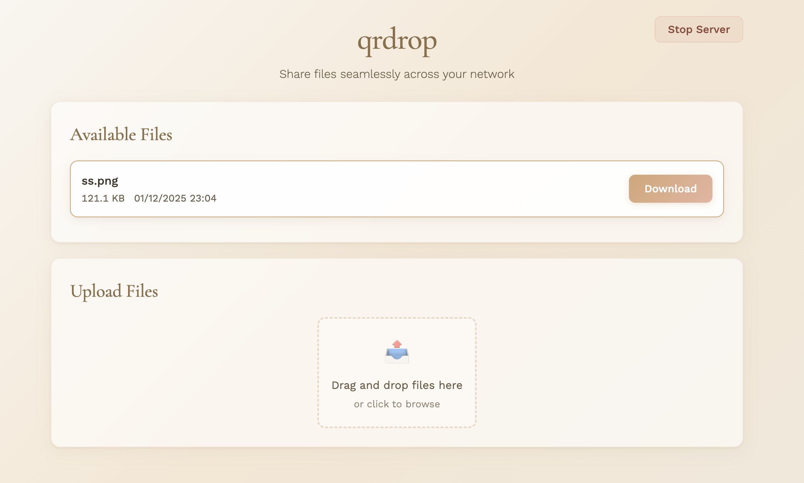

# qrdrop

A two-way LAN file-sharing CLI tool built with Bun. Share files across your local network with a simple QR code scan.

> Inspired by [`qrcp`](https://github.com/claudiodangelis/qrcp)



## Quick Install (Recommended)

**One command installation:**

```bash
curl -fsSL https://raw.githubusercontent.com/behnamazimi/qrdrop/main/install.sh | sh
```

Or with wget:

```bash
wget -qO- https://raw.githubusercontent.com/behnamazimi/qrdrop/main/install.sh | sh
```

## Installation

### Download Binary

Download the pre-built binary for your platform from [GitHub Releases](https://github.com/behnamazimi/qrdrop/releases/latest):

- **Windows:** [qrdrop-windows-x64.exe](https://github.com/behnamazimi/qrdrop/releases/latest/download/qrdrop-windows-x64.exe)
- **macOS (Intel):** [qrdrop-macos-x64](https://github.com/behnamazimi/qrdrop/releases/latest/download/qrdrop-macos-x64)
- **macOS (Apple Silicon):** [qrdrop-macos-arm64](https://github.com/behnamazimi/qrdrop/releases/latest/download/qrdrop-macos-arm64)
- **Linux:** [qrdrop-linux-x64](https://github.com/behnamazimi/qrdrop/releases/latest/download/qrdrop-linux-x64)

After downloading, make it executable (macOS/Linux):

```bash
chmod +x qrdrop
mv qrdrop /usr/local/bin/  # or ~/.local/bin
```

### From Source

For developers who want to build from source:

```bash
git clone https://github.com/behnamazimi/qrdrop.git
cd qrdrop
bun install
bun run build
```

## Usage

**Share files:**

```bash
qrdrop --file document.pdf              # Single file
qrdrop -f file1.txt -f file2.txt        # Multiple files
qrdrop --directory ./folder             # All files in directory
```

**Receive files:**

```bash
qrdrop --output ./downloads             # Upload-only mode
```

**Two-way sharing:**

```bash
qrdrop --file doc.pdf --output ./received
```

## Options

| Option                | Short | Description                        |
| --------------------- | ----- | ---------------------------------- |
| `--file <path>`       | `-f`  | Share file(s) (use multiple times) |
| `--directory [path]`  | `-d`  | Share directory (default: current) |
| `--output <path>`     | `-o`  | Directory for received files       |
| `--secure`            |       | Enable HTTPS/TLS                   |
| `--port <number>`     |       | Specify port                       |
| `--timeout <seconds>` |       | Set timeout (default: 600s)        |
| `--no-timeout`        |       | Run indefinitely                   |

## Examples

```bash
# Share and receive
qrdrop --file report.pdf --output ./incoming

# Custom timeout (5 minutes)
qrdrop --timeout 300

# Secure sharing
qrdrop --file secret.txt --secure

# Long-running server
qrdrop --no-timeout --output ./collected
```

## Troubleshooting

- **QR code not scanning?** Both devices must be on the same Wi-Fi. URL is also shown below QR code.
- **Connection refused?** Check firewall settings. Try `--port 8080`.
- **Server closes?** Default timeout is 10 minutes. Use `--no-timeout` to disable.
- **HTTPS warnings?** Normal for self-signed certs. Click "Advanced" → "Proceed" in your browser.

---

## For Developers

```bash
bun run format          # Format code
bun run format:check    # Check formatting
bun run check-types     # Type check
```

**Requirements:** Bun runtime, OpenSSL (optional, for `--secure`)

Built with Bun.
